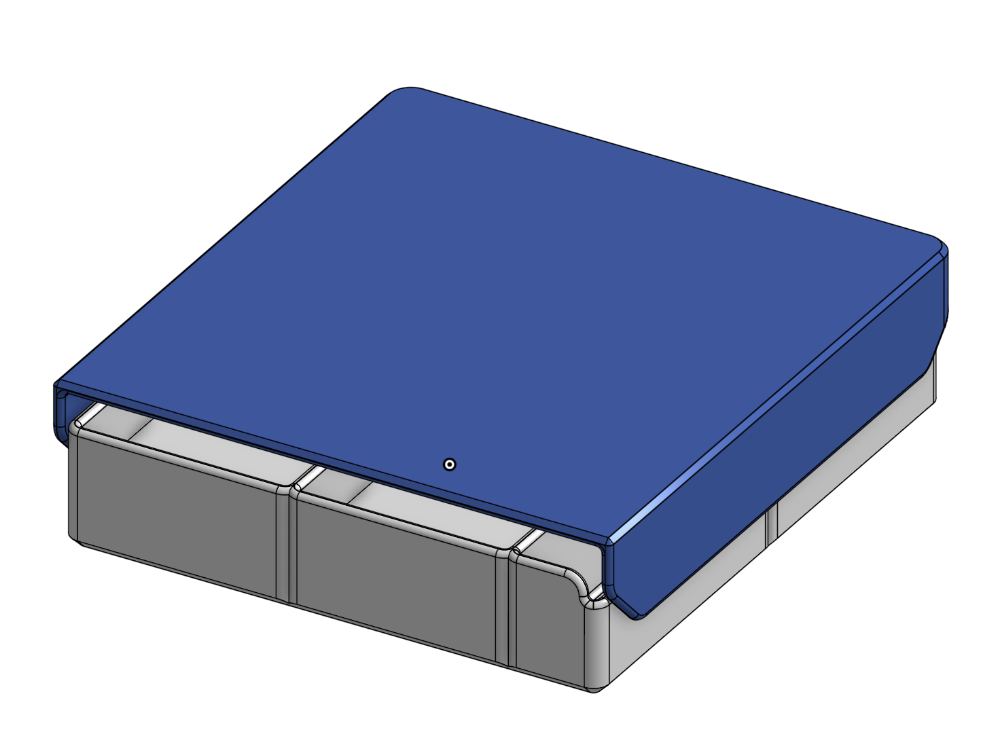
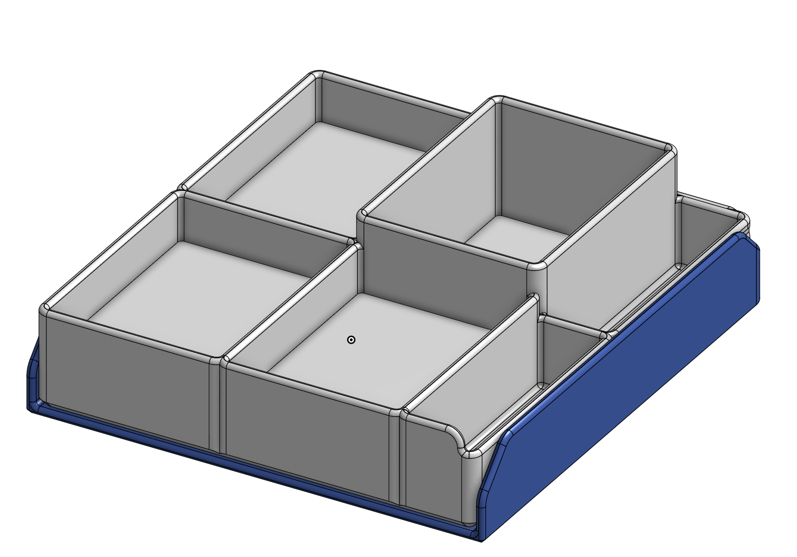
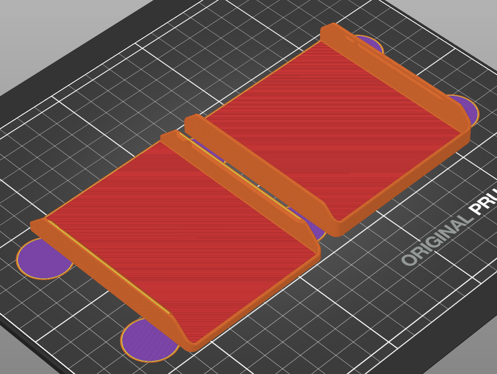
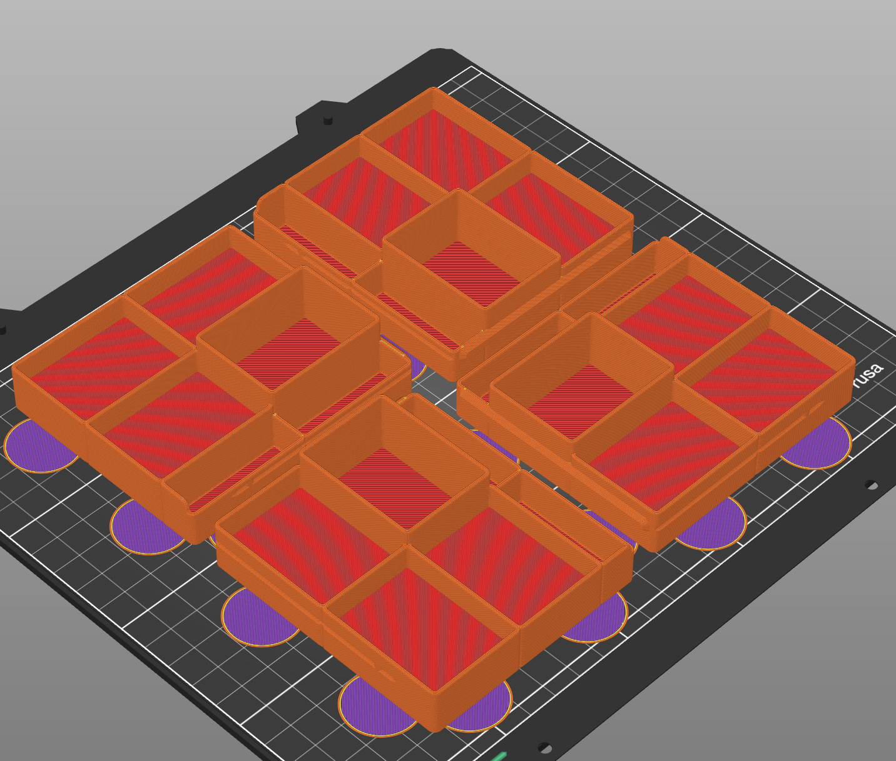
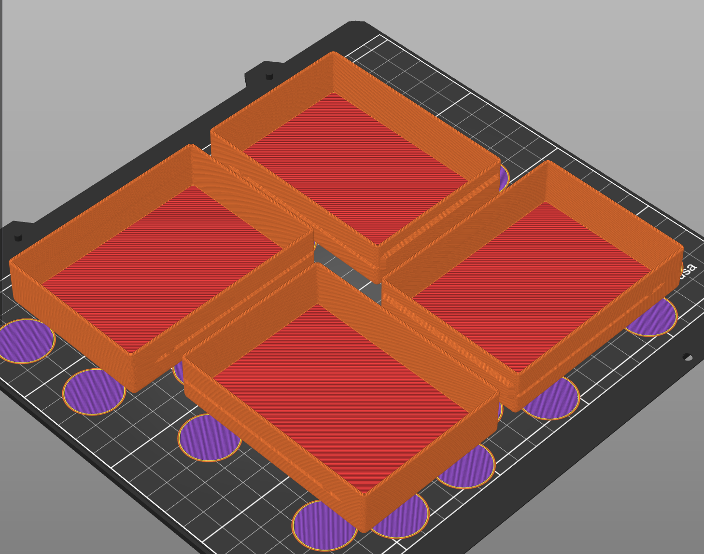
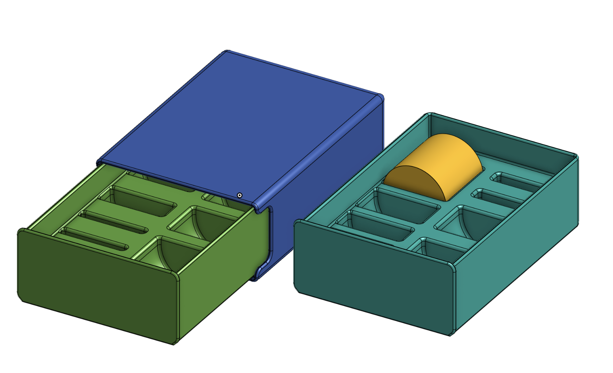
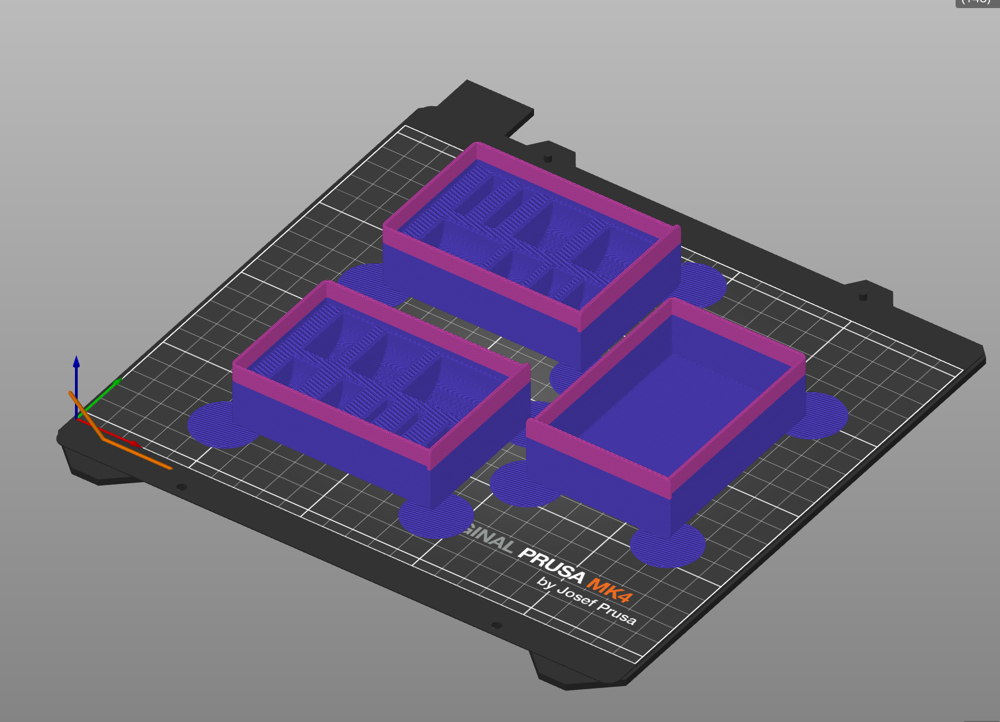
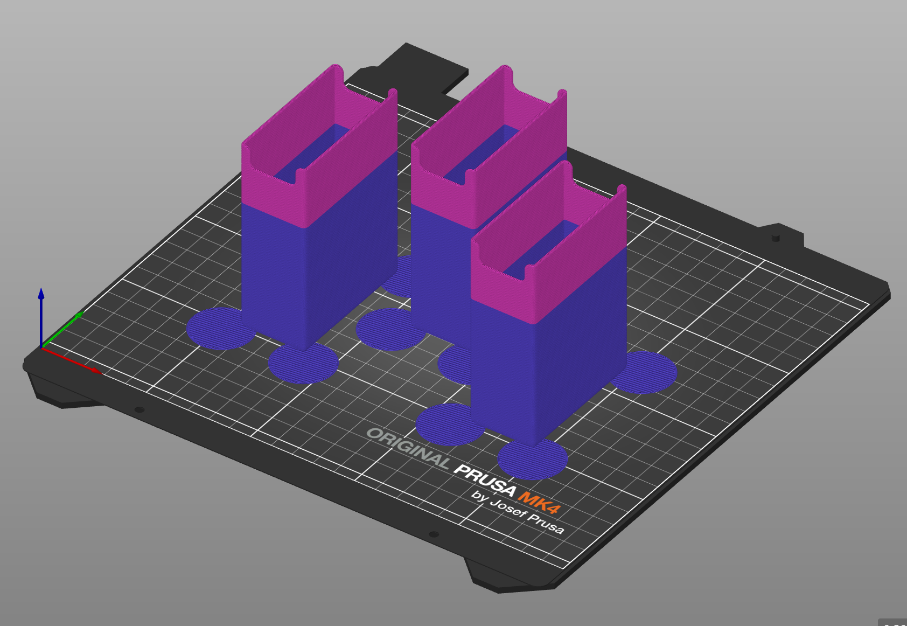

## Arcs Component Holders

For the [very excellent board game](https://www.youtube.com/watch?v=iP36OXiPkoo&t=158s&pp=ygUJc3VzZCBhcmNz) [and it's campaign expansion](https://www.youtube.com/watch?v=_GUatRy1LRk&pp=ygUJc3VzZCBhcmNz), ARCS by [Leder Games](https://ledergames.com/collections/full-catalog/arcs).

The base game of "Arcs: Conflict and Collapse in the Reach" is really improved by the bank vacuum-form tray that comes along with “The Blighted Reach” campaign expansion. However, the per-player trays don't pack well into the base game box for those who have both but haven't combined down into the larger box. Also, It's valuable information to the player to know how many Ships or Agents one has left while bargaining and planning.

I love the wooden components so much, they have so much charm to them.

These organizer trays store all wooden and cardboard player components from both the base game and the campaign expansion, and fit into the deep well of the campaign box along with save state deck boxes. The organizer trays feature a locking edge, so that they can't be opened upside down which avoids spilling!

The various decks of the base game can be stored in the Campaign Save State Boxes, until you want to integrate your base copy into a campaign box. Then the deck boxes are your per-player save states. Two functions with one object, less printing when you upgrade and less waste overall!

I recommend printing the organizer trays in a dark contrasting color (a spacey black for example!) and pairing each with a player color coordinated lids.

Provided Mouse-eared STLs and bgcode files are oriented to maximize potential variation from multi-colored filaments, if you choose to use such.

One each of the component and deck lids:

Component trays, x4:

Deck trays, x4:

~~Three boxes are also provided to store the smaller campaign fate tokens in fate number order, and a larger open box for the large fate tokens. When I printed mine out, I ran out of black, which introduced me to the two-tone aesthetic.~~

Also included is the SVG for a large form replacement wedge for laying down instead of the “hyperlanes” during non-campaign setup instructions. I cut this on my laser in 100pt chipboard, laminated with spacey, decorative paper and painted the edge, although one could print the SVG as a plate, extruded to 2-3mm or 0.1 inch as desired.

This perhaps is the tenth or later generation of exploring these objects. Careful attention to filets, chamfers, mouse-ears, and thicknesses have been considered. 

Designed in OnShape:

- [Component Holder](https://cad.onshape.com/documents/f8baa16c513774a1b4c4d1ff/w/156d0fb384fcc7c2bd21cdf2/e/2bc8450ed0d50105c287a671)
- [Save State Box](https://cad.onshape.com/documents/398fe0b94c3db610b38cdb79/w/e47fcedab68673560034f3a2/e/1cc49baec7d96f1b5932d371)
- [Token Boxes](https://cad.onshape.com/documents/398fe0b94c3db610b38cdb79/w/25091c70bdfcc1784639c936/e/1cc49baec7d96f1b5932d371)