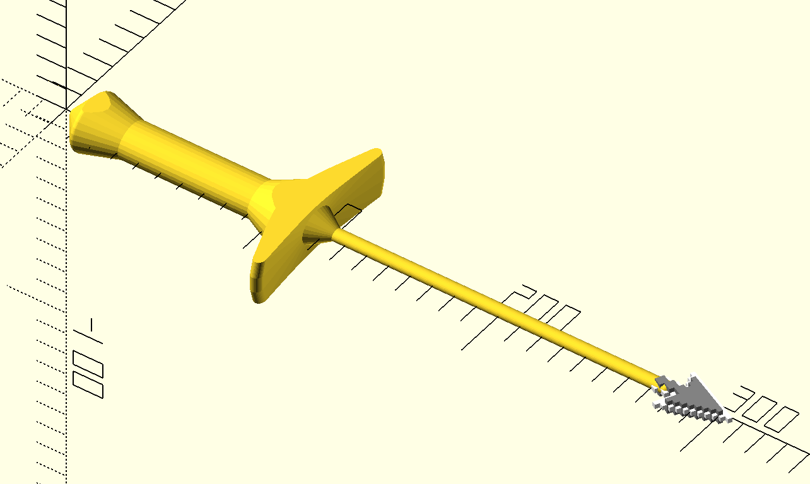

## Pointers

I was watching Dice Tower on YouTube, someone had a finger pointer to help with the rules explanation.

Once piece, small arrow & x, maxs out Prusa i3 bed at a 40º angle.

The same, but split using a t-slot to be BIGGER!

Mac OS inspired pixel pointers. I accidentally added a point that made a sword/dagger hand guard, and I couldn't bring myself to remove it.

**Arrow**

**Hand**
