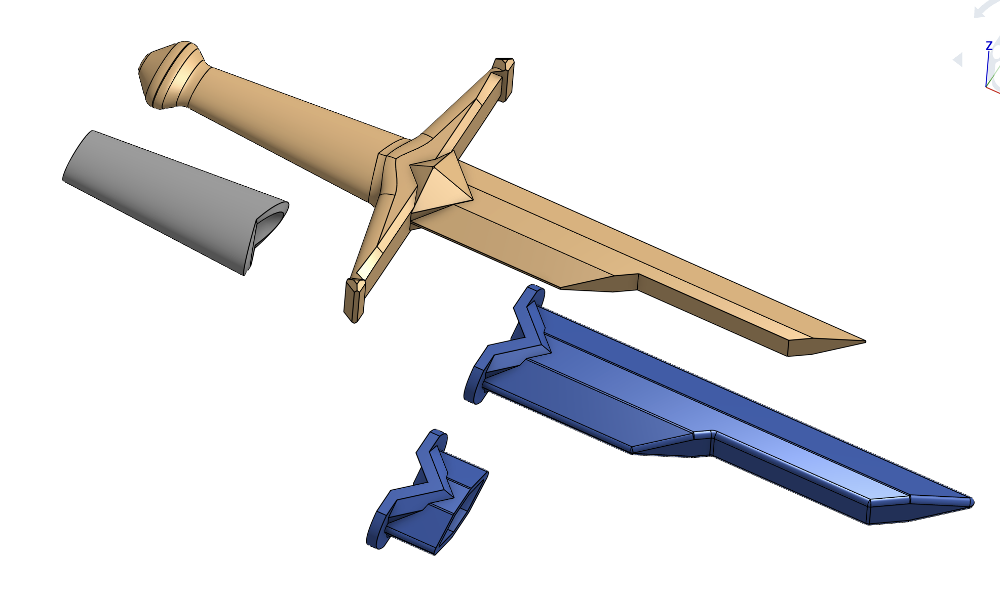

## Shattered Dagger

A prop dagger (as big as would fit on my Prusa MK4), themed lightly on the "Shards of Narsil" from "The Lord of the Rings" film prop.

When importing into the slicer, you can make a textured grip by using the "Add Modify > Load" in PrusaSlicer, and add the fuzzy-skin setting and enable. Import the `modify` part as normal to get the dimensions in case the slicer imports the modify-`modify` object too small (is this a bug) and then visually align it as you can in the Y-axis ( X and Z should likely be both be zero when in Object Coordinates). I angled the group at 35º to fit on my 250 x 210 mm bed.

Print the dagger before you print a full scabbard. A `test` intersection of the scabbard has been provided to try out various scale factors. The scabbard has zero tolerance built in, so if you print it on a different plane than the dagger, round over errors will occur and make fitting the dagger in the scabbard impossible or one-way. I think 102% was okay for my print, but I ended up going with 104% for my final print.

Interesting geometric detail, you can glue two of these together along the "shatter" and make something that looks like a sword-equivalent of a drawknife or spokeshave.

[Designed in OnShape](https://cad.onshape.com/documents/8fd88022c6663004678fa262/w/4fc7def6cca343c748adaecc/e/43a368d694a9a7e5d57b0bc9)