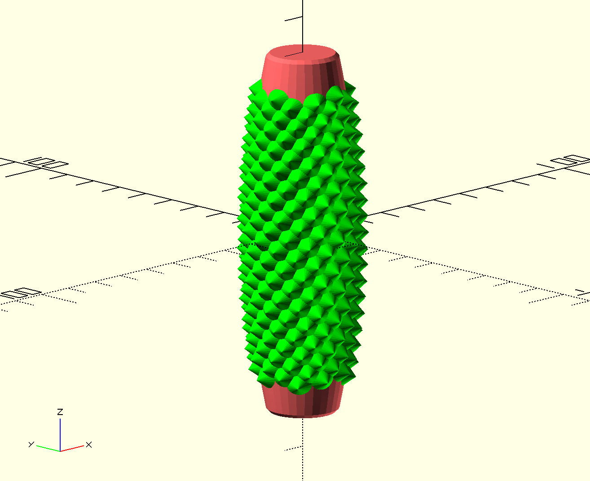

# Pain Stim Handle

A "pain stim" fidget toy, inspired by the "Grippies" product by Little Ouchies, featured on the Slant3D YouTube channel.

I wanted to implement a version that could bow in or outward (convex/concave) and with spikes arranged in a spiral (default set to the Golden Angle to produce Fibonacci spirals).

Some variations are provided along with the OpenSCAD file that generates them.

Depending on how large or small your palm, and how you like to hold, you may prefer an inwardly "shrink" style (like an apple core) or outwardly “swell” (like an inflated balloon). Straight-wall version is also possible.

## Inspired by:

- [Slant3D](https://youtu.be/KrHY6LNxY8Q)
- [Little Ouchies](https://littleouchies.com/)
- [Numberphile ](https://youtu.be/sj8Sg8qnjOg)
