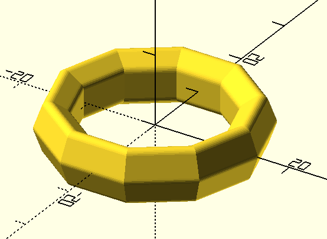
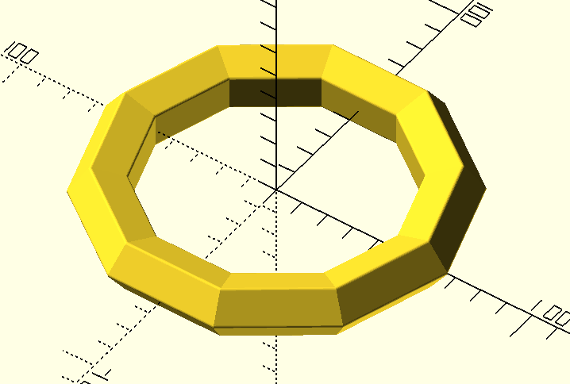
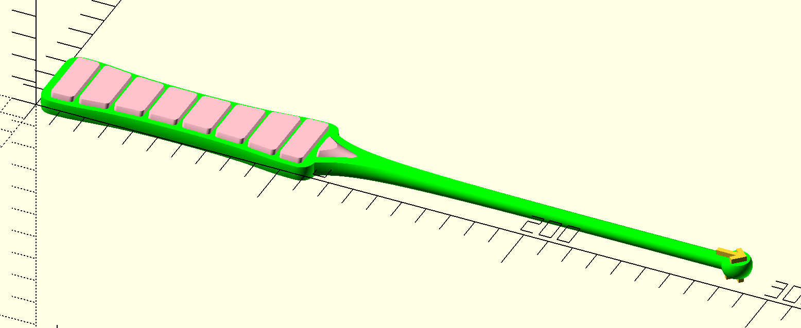
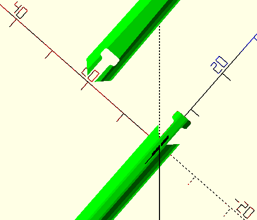
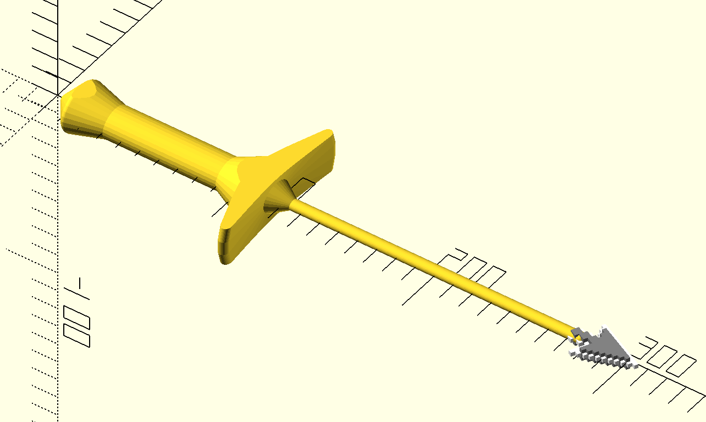

# FDM stuff

Various objects and board game accessories.

OpenSCAD files, STLs, and maybe a Fusion 360 file if I'm having a bad day.

Modules directory contains reusable OpenSCAD code.

# Projects

## Arcs Component Holders

**Broken**

Per player and bank component holders.

## Low Poly Rings

I'm an old Sonic the Hedgehog fan, and I happened to be reading "The Hobbit", so I wanted to have a prop that I could hold or wear that makes me think of either.

**Finger ring:**

**Bracelet:**

## Pointers

I was watching Dice Tower on YouTube, someone had a finger pointer to help with the rules explaination.

Once piece, small arrow & x, maxs out Prusa i3 bed at a 40º angle.

The same, but split using a t-slot to be BIGGER!

Mac OS inspired pixel pointers. I accidentally added a point that made a sword/dagger hand guard, and I couldn't bring myself to remove it.

**Arrow**

**Hand**

# Modules

## `math_tricks.scad`

<dt>`practically_zero` : scalar</dt>
<dd>For times you want a 2d element to technically exist within R^3.</dd>

<dt>`epsilon`</dt>
<dd>A very small number for offsetting surfaces, often to avoid z-fighting or to help union or splitting parts with minimal side-effects. Control the scale of this value with `$epsilon_scale`.</dd>

<dt>`pz(value: scalar, negative: bool ) -> scalar`</dt>
<dd>If value is zero, replace with `practically_zero` (optionally as a negative).</dd>

<dt>quick vectors: `xv`, `yv`, `zv`, `xyv`, `yzv`, `zxv`, `dv`, </dt>
<dd>
  When you don't want to write out the full `vect3` notation to do a single axis translate, scale, or rotate. One in each axis and pair, and one in the R^3 "diagonal" (not normalized). 
</dd>

<dt>quick vector functions: `iv()`, `jv()`, `kv()`, `ijv()`, `jkv()`, `kiv()`, `ijkv()`</dt>
<dd>Same as above, but feed a scalar to get an `vect3`</dd>

## `t_slots.scad`

<dt>`t_slot_slice( positive, part_window, interface_angle, t_round, t_width, t_thick, t_neck, t_neck_thick, t_height)`</dt>
<dd>Volume that creates a t-slot near the origin. Positive and negative versions of the same feature for matching features.</dd>

## `handles.scad`

<dt>`grip_wand( height ,  detail_height ,  disc_height, center_offset, lw )`</dt>
<dd>Handle for a pointer.</dd>

<dt>`handle_sword()`</dt>
<dd>Handle for a pointer, also looks like a sword.</dd>

<dt>`x_axis_polygon_revolve( points )`</dt>
<dd>Lathe a list of points along the x-axis.</dd>

## `icons.scad`

<dt>`icon_hand(center_height, outline_height)`</dt>
<dd>An old hand pointer.</dd>

<dt>`icon_arrow(pointing = false, center_height, outline_height)`</dt>
<dd>An old arrow pointer.</dd>

<dt>`svg_extrude(height, file_path, center_plane = false)`</dt>
<dd>Open an SVG and extrude in a single line.</dd>

